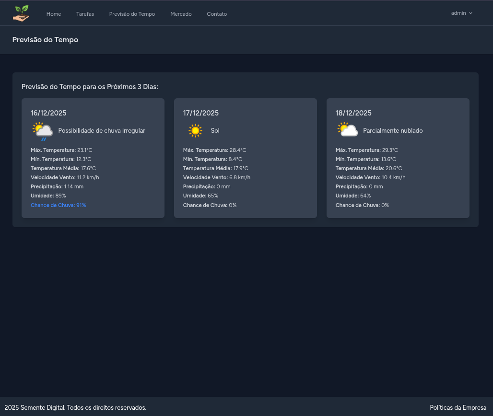
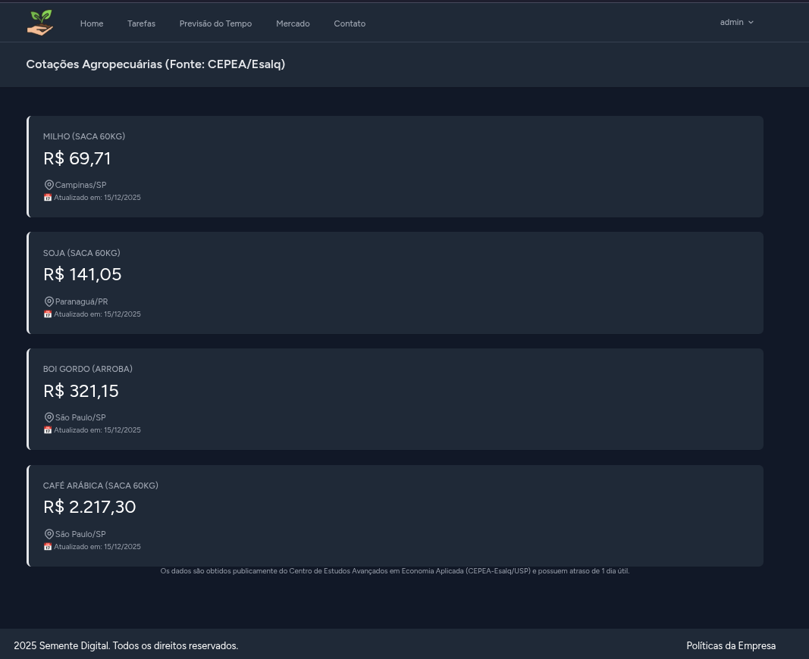

````markdown
# 🌱 Semente Digital - Plataforma de Gestão Rural

> Uma solução robusta para produtores rurais acompanharem o clima, cotações de mercado e gerenciarem suas tarefas diárias.


## 💻 Sobre o Projeto

O **Semente Digital** é uma aplicação web Fullstack desenvolvida para centralizar informações vitais para o agronegócio. O diferencial técnico deste projeto reside na sua arquitetura resiliente e no uso de estratégias avançadas de obtenção de dados (APIs e Web Scraping) com otimização via Cache.

## 🚀 Funcionalidades Principais

### 1. 🌤️ Previsão do Tempo Inteligente
- **Integração:** Consumo da API oficial **WeatherAPI**.
- **Performance:** Implementação de **Cache Redis** (TTL 6 horas) para evitar consumo excessivo de cotas da API.
- **Arquitetura:** Uso de **DTOs (Data Transfer Objects)** para padronizar os dados entre a API externa e a View.

### 2. 📈 Cotações de Mercado (Web Scraping)
- **Engenharia Reversa:** Robô desenvolvido com `Symfony DomCrawler` que extrai dados em tempo real do site do **CEPEA/Esalq**.
- **Dados:** Monitoramento de Soja, Milho, Café e Boi Gordo.
- **Resiliência:** Sistema de **Cache Redis** (TTL 12 horas) para evitar bloqueios de IP e garantir alta disponibilidade mesmo se o site fonte oscilar.

### 3. ✅ Gestão de Tarefas
- CRUD completo para gerenciamento de atividades rurais.
- Autenticação e segurança de dados por usuário.

---

## 🛠️ Tecnologias e Arquitetura

O projeto foi construído seguindo os princípios de **Clean Code** e **SOLID**, fugindo do padrão básico MVC e adotando camadas de serviço.

- **Backend:** Laravel Framework (PHP 8.2+)
- **Frontend:** Blade Templates + Tailwind CSS (Responsivo)
- **Banco de Dados:** MySQL 8.0
- **Cache & Sessão:** Redis (Alpine)
- **Infraestrutura:** Docker & Docker Compose (Ambiente containerizado customizado)
- **Design Patterns:**
    - **Service Pattern:** Lógica de negócios isolada dos Controllers.
    - **Repository/DTO Pattern:** Transferência de dados tipada e segura.
    - **Dependency Injection:** Para testabilidade e desacoplamento.

---

## 📸 Screenshots

*(Adicione aqui os prints das telas do seu projeto)*

| Previsão do Tempo | Cotações de Mercado |
|:---:|:---:|
|  |  |

---

## ⚙️ Como Rodar o Projeto Localmente

Este projeto utiliza **Docker**, o que torna a instalação extremamente simples e agnóstica ao sistema operacional.

### Pré-requisitos
- Docker e Docker Compose instalados.
- Git.

### Passo a Passo

1. **Clone o repositório:**
   ```bash
   git clone [https://github.com/seu-usuario/sementedigital.git](https://github.com/seu-usuario/sementedigital.git)
   cd sementedigital
````

2.  **Configure as Variáveis de Ambiente:**

    ```bash
    cp .env.example .env
    ```

    *Edite o arquivo `.env` e adicione sua chave da WeatherAPI em `WEATHERAPI_KEY`.*

3.  **Suba os Containers:**

    ```bash
    docker compose up -d
    ```

4.  **Instale as Dependências:**

    ```bash
    docker compose exec app composer install
    docker compose exec app npm install
    docker compose exec app npm run build
    ```

5.  **Configure o Banco de Dados e Cache:**

    ```bash
    docker compose exec app php artisan key:generate
    docker compose exec app php artisan migrate
    ```

6.  **Acesse:**
    O projeto estará rodando em: `http://localhost`

-----

## 🧪 Comandos Úteis

  - **Limpar Cache:** `docker compose exec app php artisan cache:clear`
  - **Acessar Container:** `docker compose exec app bash`
  - **Logs em Tempo Real:** `docker compose logs -f`

-----

## 📝 Licença

Este projeto está sob a licença MIT.

```